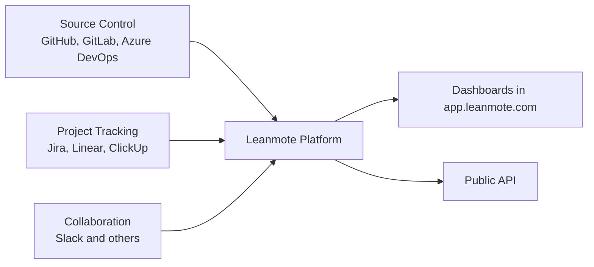

# Platform Overview

Leanmote uses a product architecture designed for one purpose: turning engineering operational data into clear and actionable metrics.

## High-level architecture

## What this means for customers

- You connect systems your teams already use
- Leanmote normalizes and correlates that data
- Dashboards and API expose metrics for operational and strategic decisions

## Data lifecycle (public view)

1. Authorize integrations from the app
2. Historical sync imports baseline data
3. Incremental updates keep metrics current
4. Dashboards and APIs return filtered, organization-scoped results

## Security and isolation principles

- Organization-scoped data boundaries
- Role-based access for product users
- Token-based API authentication
- Auditable access and usage controls

## Reliability approach

- Automated sync retries for transient provider failures
- Continuous monitoring of ingestion and metric freshness
- Historical retention to support trend analysis over time

## Related docs

- [Workspace Configuration](../getting-started/configuration.md)
- [Metrics Methodology](../metrics/how-we-measure.md)
- [API Overview](../api/overview.md)
